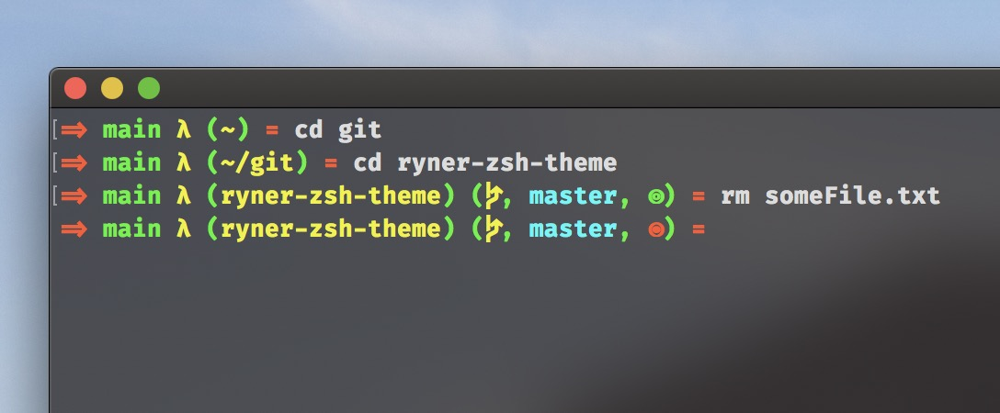

# How to install?

Just place `ryner.zsh-theme` at `~/.oh-my-zsh/themes/`  

Then add `ZSH_THEME="ryner"` to your `~/.zshrc` (Attention! Do not allow to have more than 1 `ZHS_THEME` field in your `~/.zshrc` file)

# How it looks like

